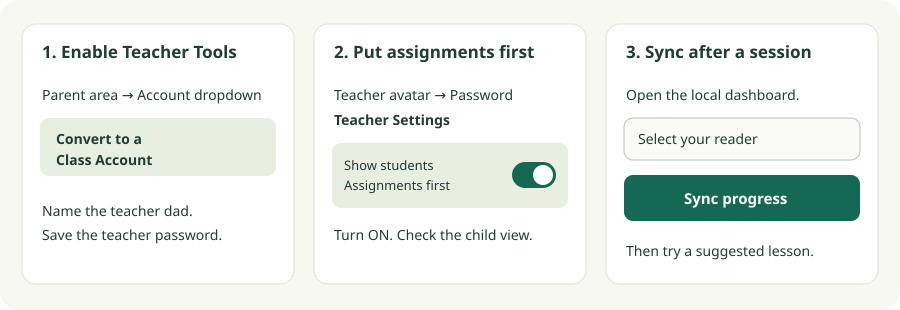

# Khan Kids Reading Tutor

**Master reading with adaptive practice over Khan Kids' phonics lessons—no fluff.**

Ten focused reading assignments, practice until mastery, and a clear recommendation
for what your child should try next.

After a lesson session, open the local dashboard, choose your reader, and click
**Sync progress**. It checks scores and refreshes the assignments for you.
Routine use runs on your computer and uses no AI tokens.

## How it helps

- **A reading path, not the whole library.** Sound awareness, blending, and
  decoding take priority over completing every ELA lesson.
- **Practice before promotion.** Lessons advance after a latest score of 100%,
  or two consecutive scores of at least 90%.
- **Ten assignments to choose from.** A mix of prerequisite-ready reading work
  and foundational stretch activities keeps the queue manageable.
- **A useful next step.** The report suggests up to three assigned lessons,
  including activities close to mastery.
- **A lasting progress record.** Attempts and assignment changes are retained
  without duplicating unchanged scores on repeat runs.

The [reading path](reading-path.md) assumes basic letter–sound knowledge.
Check it against your child's starting point. Variants progress through
**Basic → Main → Practice 1 → Practice 2**, skipping unavailable rungs.
These are this project's rules, not Khan's default promotion policy.

### Mastery, not just completion

The dashboard combines dated sync attempts with saved All Progress scores for
every mapped reading lesson. Saved report scores remain labeled as snapshots:
their capture date is not a lesson date, and they do not count as new weekly
attempts. A single saved 100% supplies mastery evidence; separate summary cells
cannot establish two consecutive 90% attempts.

During sync, the bar advances through actual workflow stages and fills only
when the run completes. It has no looping animation or visible percentage;
it shows stage completion, not an estimate of time remaining.

In our family's use, the Learning Path sometimes felt like **failing forward**:
harder work appeared before a lesson was secure, rather than requiring another
attempt after a score such as 70%. Khan does describe its
[Learning Path as adaptive, with extra practice and easier activities](https://khankids.zendesk.com/hc/en-us/articles/360048828572-Learn-more-about-the-Learning-Path),
so this is our experience—not a claim that it never revisits a skill.

This tutor makes the mastery gate explicit: practice before promotion, using
the score rules above, and step back to easier support when appropriate.
We aim for the [zone of proximal development](https://en.wikipedia.org/wiki/Zone_of_proximal_development):
work your child can learn to do with support, rather than moving ahead merely
because an activity was completed. Scores guide assignments; they aren't an
independent assessment of reading ability.

## Set up once, then just sync

Follow the steps below in order. The current tested setup is a Pixel Tablet and
a Linux computer; the browser dashboard still needs the local tools installed.

## What you need

- Khan Academy Kids with a **Class Account**.
- An Android tablet and a Linux computer with Python 3.13, ADB, ImageMagick,
  and `uv`. `scrcpy` is optional for watching the tablet on your computer.
- Comfort with a terminal and Android Developer options.

The current automation is tested on a **Pixel Tablet at 2560×1600 in landscape,
with Khan Kids 9.0.1**. Other devices, app versions, and roster layouts may need
calibration. Watch the first review before allowing assignment changes.
This is a working family project, not a one-click installer for every tablet.

## 1. Set up Khan Kids

### Enable Teacher Tools

Use the account containing your child's existing progress:

1. Open Khan Kids and enter the **Parent** area using its swipe gate.
2. Tap the **account dropdown**.
3. Tap **Convert to a Class Account**, then follow the prompts.
4. Set the teacher profile name to **dad** (lowercase) and save its password.
5. Open the teacher's **bear avatar**, enter that password, and confirm you see
   the student roster.



This is an original button guide, not a screenshot of a child's account.
Follow the numbered instructions if your app's layout differs.

For the current automation, the teacher profile's display name must be **`dad`**
(lowercase). Use that name when setting up Teacher Tools; a different teacher
name requires adapting the profile matching in `tools/khan_kids/automation.py`.

Khan documents that existing profiles and progress carry over. Follow its
[conversion instructions](https://khankids.zendesk.com/hc/en-us/articles/360042944391-FAQ-How-do-I-convert-my-account-to-a-Class-Account),
or [create a new Class Account](https://khankids.zendesk.com/hc/en-us/articles/360042193551-Module-1-Setting-up-a-Class-Account).
The free in-app Teacher Tools are sufficient; you do not need the paid school dashboard.

### Strongly recommended: assignments-first access

Enable **Show students Assignments first** so your child works on the selected
lessons before exploring other areas of Khan Kids:

1. Open the teacher's bear avatar and enter the teacher password.
2. Open **Teacher Settings** in the top-left corner.
3. Turn **Show students Assignments first** **ON**.
4. Check the child's profile: other areas should be unavailable while assignments
   are incomplete.

After all assignments are complete, Khan unlocks the other areas. This is an
assignments-first gate, not a permanent assignments-only lock or our score-based
mastery rule. See [Khan's setting instructions](https://khankids.zendesk.com/hc/en-us/articles/17031195532059--NEW-Manage-student-access-to-areas-of-the-app).

Set this manually once during onboarding. The tutor does not enable or verify
it yet. Automated setup needs verified Settings controls, an already-ON no-op,
and a fresh persistence check. Create/Videos restrictions are separate choices.

## 2. Install the computer tools

On Ubuntu:

```bash
sudo apt update
sudo apt install git adb imagemagick
git clone https://github.com/JohnTheodore/khan_kids_reading_tutor.git
cd khan_kids_reading_tutor
```

Install `uv` using its [official instructions](https://docs.astral.sh/uv/getting-started/installation/),
then install the locked dependencies:

```bash
uv sync --frozen
```

For an optional live view, install a current
[scrcpy release](https://github.com/Genymobile/scrcpy/blob/master/doc/linux.md).

## 3. Connect the tablet

Choose **USB** for the simplest first connection, or **wireless** for cable-free
daily use.

**USB:**

1. On the tablet, open **Settings → About tablet**.
2. Tap **Build number** seven times; enter the tablet PIN if asked.
3. Open **Settings → System → Developer options**.
4. Turn **USB debugging** on.
5. Connect a data-capable USB cable to the computer. Disconnect the Pixel Tablet
   from its charging/audio stand first.
6. On the tablet, approve **Allow USB debugging?** for your own trusted computer.
7. On the computer, run `adb devices`. Continue when the tablet appears with
   status **device**. If it says **unauthorized**, check the tablet for the prompt.

**Wireless:**

1. Under **Settings → About tablet**, tap **Build number** seven times.
2. Open **System → Developer options → Wireless debugging** and turn it on.
3. Put the tablet and computer on the same trusted network.
4. Choose **Pair device with pairing code**, then pair using that dialog's address:

```bash
adb pair TABLET_IP:PAIRING_PORT
# Enter the pairing code when prompted.
```

Connect using the separate address on the main Wireless debugging page:

```bash
adb connect TABLET_IP:DEBUG_PORT
adb devices
```

Ports can change. After a cold reboot on the tested Pixel Tablet, physically
unlock it and re-enable Wireless debugging; pairing usually survives, but the
switch does not stay on.

Set the current connected transport—either the USB serial or wireless `IP:port`
shown by `adb devices`—and get the device's identity:

```bash
KHAN_SERIAL='YOUR_CONNECTED_ADB_SERIAL'
adb -s "$KHAN_SERIAL" shell getprop ro.serialno
adb -s "$KHAN_SERIAL" shell getprop ro.product.model
```

Save those returned values in the configuration below. The resolver recognizes
an already-connected matching device. Automatic wireless rediscovery also
supports the original Linux-in-OrbStack setup through macOS mDNS; on other hosts,
use USB or reconnect with `adb connect` when the wireless port changes.

If Android 17 Wi-Fi debugging needs newer ADB, install current SDK Platform Tools
under `private/android-sdk/platform-tools`; wrappers prefer that private copy.
See [connection details](tablet-persistent-adb-research.md) for reboot limitations.

## 4. Give your family its own configuration

From the repository directory:

```bash
mkdir -p private/my-family
```

Create `private/student-aliases.local.json`. Replace the placeholder with the
child's exact name in Khan Kids:

```json
{
  "YOUR_CHILD_DISPLAY_NAME": "Student A"
}
```

Include every child on the account, adding `Student B`, `Student C`, and so on.
Aliases keep real names out of exported records.

Create `private/tablet-device.local.json` using the hardware serial and model
returned by the commands above:

```json
{
  "student": "Student A",
  "hardware_serial": "HARDWARE_SERIAL_FROM_GETPROP",
  "model": "MODEL_FROM_GETPROP"
}
```

Create `.secrets.json` in the repository root:

```json
{
  "android_pin": "YOUR_TABLET_PIN",
  "khan_parent_password": "YOUR_TEACHER_PASSWORD"
}
```

The PIN is needed only when the tablet is locked. Preserve password capitalization.
Automatic password entry currently supports ASCII letters and digits; passwords
containing symbols need a keyboard-entry adaptation before unattended login.
When Khan Kids is already on a recognized child home or Assignments screen,
the tutor navigates to the profile picker without restarting the app. Parent
password key presses share one ADB connection, preserving capitalization and
keeping the password out of command arguments. Unsupported screens or failed
navigation stop the sync without restarting, preserving owner-private diagnostic
captures under `private/startup-blocked-*`. The verified three-card prize prompt
is handled automatically: the tutor chooses a prize at random for the selected
child, taps once, and waits for the child home screen before continuing. It never
repeats an uncertain award or restarts past an unfamiliar reward screen; new
layouts remain available for inspection.
Protect the files:

```bash
chmod 600 .secrets.json private/student-aliases.local.json private/tablet-device.local.json
```

### Match the catalog to your roster

Reuse the lesson inventory, but give your account its own catalog copy:

```bash
cp data/reading-ela-archive.json private/my-family/catalog.json
```

In that copy, edit the top-level `students` list to match your account's aliases,
in the order shown in Class Reports. For one child:

```json
"students": ["Student A"]
```

The tutor uses the catalog for lesson locations and variants. Scores come from
your tablet and your own attempt/action files—not the example family's archived
result fields. A different roster layout still needs a watched pilot review.

### Save a one-command launcher

Keep your records separate from the example family records included here.
Save this as `private/my-family/sync.local.sh`:

```bash
#!/usr/bin/env bash
set -euo pipefail
repo_dir="$(cd -- "$(dirname -- "${BASH_SOURCE[0]}")/../.." && pwd)"
family_dir="$repo_dir/private/my-family"
mode=sync
if [[ "${1:-}" == review || "${1:-}" == sync ]]; then
  mode="$1"
  shift
fi
case "$mode" in
  review)
    workflow=khan-reading-sync
    plan_args=(--plan "$family_dir/reading-plan.json")
    ;;
  sync)
    workflow=khan-mastery-sync
    plan_args=()
    ;;
  *)
    printf 'Usage: %s [review|sync]\n' "$0" >&2
    exit 2
    ;;
esac
exec "$repo_dir/$workflow" \
  --student 'Student A' \
  --catalog "$family_dir/catalog.json" \
  --attempts "$family_dir/lesson-attempts.csv" \
  --actions "$family_dir/assignment-actions.csv" \
  --report "$family_dir/reading-sync-log.md" \
  --quarantines "$family_dir/lesson-quarantines.csv" \
  --history-cache "$family_dir/score-history-cache.json" \
  "${plan_args[@]}" "$@"
```

Make it executable:

```bash
chmod 700 private/my-family/sync.local.sh
```

This launcher only supplies your paths to the existing workflow; it is not a
second tutor implementation. Change its alias when targeting another child.

## 5. Preview, then start using it

Watch the tablet directly or mirror it:

```bash
scrcpy --serial "$KHAN_SERIAL" --stay-awake
```

Start with a review:

```bash
./private/my-family/sync.local.sh review
```

Review opens the teacher reports, reads scores, and saves a proposed plan.
It does not change assignment checkboxes, although it records newly observed
attempts. Check the child, lesson names, score evidence, and proposed removals—
the planner reconciles the existing queue, not just new assignments.

When the preview looks right, run:

```bash
./private/my-family/sync.local.sh
```

### Daily use: open the dashboard

After completing setup, run `./khan-dashboard`. It opens your family's reading
dashboard: each reader's current focus, gains over the last seven days, a map
from letters through comprehension, and suggested next practice. The reading
map groups skills into six phases, with vocabulary, language and writing shown
as supporting skills. Skills develop together—not as a rigid checklist.
**Sync progress applies changes**, just like the
command-line launcher; the dashboard does not implement a second mastery policy.

1. Choose your child in **Reader**. The selection stays set when you refresh.
2. Glance at **Working on** and **The last 7 days**.
3. Click **View current practice**, or open a phase, skill and topic, to see exact variants,
   score dates and mastery evidence. Lessons without recorded scores are in
   **No recorded scores**; missing evidence does not mean failure.
   A topic counts once when a non-Basic variant meets the mastery goal, even if
   other variants still need practice. Bars show recorded topic coverage, not a
   reading level. Alphabet buttons show just the selected letter's evidence.
   Archived reading/listening exposure stays separate from scored mastery;
   uncertain dates are excluded from weekly gains.
4. After a session, click **Sync progress**. **Latest check-in** shows new scores,
   verified assignment changes and the best next lessons from the ten assignments.
5. To choose practice yourself, open a lesson and click **Assign** beside its
   exact variant (Basic, Main, Practice 1 or Practice 2). The tablet saves it
   now; the dashboard confirms it only after verification. **Unassign** removes
   that variant and pauses its automatic reassignment until you assign it again.

Assign and Unassign are **direct edits**, not mastery syncs: they change only the
requested variant, verify its checkbox and live queue, and refresh the browser
automatically. You can click other lessons while an edit runs; requests are saved
locally, with inline Queued/Updating/Verified feedback. Nearby clicks are collected
for half a second. Requests for the same reader and grade share a catalog-ordered
traversal: each saved checkbox is checked in place, followed by one shared live
queue verification. Compatible clicks received during that traversal can join it;
earlier lessons and different readers/grades get a separate batch. A newer request
replaces an opposite request only if the older one has not started. Partial
failures are reconciled read-only; saved edits are never blindly replayed.
Teacher view stays open for **60 seconds after the last edit**, so another request
reuses the connection and login. Then it logs out through Khan Kids' UI without
closing the app. An interruption stops pending requests; a dashboard restart never
automatically replays unfinished edits. Check the tablet and explicitly retry them.
Use **Sync progress** separately to collect scores and apply the mastery algorithm.

Every dashboard sync receives a correlation ID and retains a bounded, owner-private
run record under `private/sync-runs/`. The record connects its sanitized output,
structured result, phase timings and any incident. On failure it also attempts to
capture the final UI hierarchy, screenshot and last 200 Android log entries before
Android Home cleanup changes the screen, plus a Python traceback. Password-dialog UI is never captured,
common device/secrets patterns are redacted, files use owner-only permissions and
only the newest 20 runs are retained.

For a failing manual edit, launch `./khan-dashboard --debug`. Timestamped events and
bounded navigation traces stay in owner-private `private/dashboard-debug/`; normal
sync failure capture does not require debug mode. Open **Connection & setup →
Technical details** for current progress. Debug mode never automatically replays
failed or blocked requests. Stop the dashboard and relaunch without `--debug` when
diagnosis is complete.

Each variant shows its own mastery evidence and last verified assignment state.
Assignment status is a snapshot from the last completed operation, not a live
tablet connection. Manual additions are protected extras and may take the queue
above ten. Automatic top-ups pause at ten or more; subsequent syncs retire mastered
manual lessons and resume filling below ten. Archived reader profiles are read-only.
Keep the tablet unlocked on the configured account when making changes. Overrides
are saved locally in owner-private `private/*-manual-assignments.json` files and
are not published to Git. Controls require the native `khan-mastery-sync` launcher.
You can assign a mastered variant for review; a later sync may retire it using
its existing mastery evidence.

The reading map covers 13 categories, including lowercase/uppercase letters,
blending, CVC words, blends, digraphs, vowel patterns, word parts, fluency and
comprehension. Progress counts **lesson families with mastery evidence**, not
unique skills: repeated grade placements and practice variants don't inflate
it. One non-Basic variant must meet the existing mastery rule for its family
to have evidence. That does not prove the whole skill is mastered independently.
Missing evidence means **Not assessed**, not failed. Weekly growth uses actual
lesson dates, not when a delayed score was discovered; inferred/unknown dates
are excluded from exact weekly totals.

**Second-grade reading is not certified by app scores.** The dashboard gives
parent check-in prompts for unfamiliar-word decoding, oral fluency and
comprehension. It withholds a completion date until a complete reading route
and adequate evidence exist; the current automated assignment path covers
only a foundational segment. The full map does not silently expand that path.

Older account histories can be included read-only using
`private/dashboard-profiles.local.json` (permissions `600`):

```json
{
  "Student B": {
    "attempts": "private/archived-reader/lesson-attempts.csv",
    "format": "archive",
    "archived": true
  }
}
```

Use an alias already in your private student mapping and the normalized history
CSV from the archive exporter. Archived readers cannot launch a sync, and no
account is switched automatically. Optional `captured_on` records a known
capture date; absent dates remain unknown. File paths and names stay private.
Custom sync engines keep their isolated reports and do not read native-family
history for the reading map.

The service binds only to `127.0.0.1`. An authenticated launch URL opens the UI;
keep that URL private. Credentials remain in your owner-private local file,
and student data stays on your computer. The student dropdown shows names from
your private mapping; sync commands and public records still use anonymous
student aliases. Names are not embedded in the website assets or source code.
No GitHub Pages, cloud server, WebUSB,
or AI API is involved. Initial installation and Android pairing still require
the setup steps above—the dashboard is not an installation-free website.

Completed setup stays collapsed. The main screen shows score/mastery changes,
three suggested lessons, and the verified assignment count. Past results survive
dashboard restarts; custom-launcher results are cached privately per launcher.
Technical logs are available only in **Connection & setup → Technical details**.

Wireless uses the existing configured device discovery. For a USB-connected
tablet, enable USB debugging, authorize your computer, and run
`./khan-dashboard --serial YOUR_USB_SERIAL`. Use `adb devices` to find the serial.
USB avoids re-enabling Wireless debugging, but zero-interaction reboot recovery
is not verified on our tablet; unlocking or authorization may still be needed.

New families should use their isolated launcher from step 4:
`./khan-dashboard --workflow private/my-family/sync.local.sh`.
The launcher must accept forwarded `--student`, `--json`, and optional `--serial` arguments,
as the example above does. Custom wrappers can retain their own curriculum and
record paths. The default dashboard uses the repository's default record paths.

Closing the browser does not cancel a sync. Stop the service with Ctrl+C; it waits
for an active sync to finish safely. `--no-browser` prints the launch URL without
opening it, and `--port` selects another local port. The setup checklist inspects
local files and dependencies, not live tablet connectivity; the engine performs
the actual connection, account, and queue checks. Unexpected startup screens
stop without restarting and retain private captures for inspection.


### Optional scheduling and background dashboard

Schedule the same isolated launcher with cron; the dashboard need not be open.
For example, a weekday evening run (replace both absolute paths):

```cron
0 19 * * 1-5 /absolute/path/to/repo/private/my-family/sync.local.sh >> /absolute/path/to/repo/private/my-family/scheduled-sync.log 2>&1
```

Keep scheduled logs private and the tablet reachable. The engine's process lock
prevents overlapping dashboard and scheduled workflows. A scheduler cannot
bypass Android's post-reboot unlock/debugging requirements.

For an always-available dashboard, an optional **user** systemd service can use
the following unit (replace the absolute paths). Do not expose it on a LAN or
put it behind a public proxy:

```ini
[Unit]
Description=Local Khan Kids Reading Tutor dashboard

[Service]
WorkingDirectory=/absolute/path/to/repo
ExecStart=/absolute/path/to/repo/khan-dashboard --no-browser --workflow /absolute/path/to/repo/private/my-family/sync.local.sh
KillSignal=SIGINT
KillMode=process
TimeoutStopSec=infinity

[Install]
WantedBy=default.target
```

Save it as `~/.config/systemd/user/khan-dashboard.service`, run
`systemctl --user daemon-reload`, then
`systemctl --user enable --now khan-dashboard`. Find the private launch URL with
`journalctl --user -u khan-dashboard -n 10`. These stop settings let an active
sync finish rather than killing it mid-change. No service or cron entry is
installed automatically. An always-on home computer can run the same engine;
Raspberry Pi/dependency compatibility still needs testing.

Sync reads current state again, applies the desired queue, and verifies it.
Every change is checked after Save; a second complete queue scan must match
before success is reported. The app logs out to the profile chooser, then Android
Home is pressed and verified. Khan Kids remains suspended in the background, so
the tablet leaves fullscreen with its system controls available and the next
launch resumes quickly. This Home handoff also runs after failures, once private
diagnostics have preserved the app screen.

Run that same command after learning sessions. For the original configured
family, `./khan-mastery-sync` alone remains the usual command; the launcher
above keeps a new family's records separate.

## Reading the report

Start with **Changes since last sync** and **Do next**:

- 🟡 **New score/hold:** a newly captured attempt or a lesson needing more practice.
- 🟢 **Mastered:** score history meets the promotion rule.
- 🟣 **Unchecked/deferred:** a lesson was removed or set aside, with the reason.
- 🔵 **Added:** the next variant or another eligible reading lesson.
- ⚪ **Unchanged:** no new relevant evidence or assignment changes.

The report includes score evidence, the final queue, and duration. **Do next**
ranks up to three already-assigned lessons; it does not add extra assignments.
Use it to pick a near-mastery lesson to finish or a new activity to introduce.

Look for a verified outcome. A review-required result describes proposed
changes, not applied ones. Failed runs distinguish saved from verified actions.

## Common questions

**Will another sync change things if my child hasn't done a lesson?**

Not when available evidence and the queue are unchanged. Reports/timings still
append. Khan can reveal delayed scores later, so runs may legitimately see new
evidence even without a lesson between them.

**Why ten assignments?**

It provides a manageable mix of core and stretch work. Ten is the automatic
target on successful completion, not during transitions or interrupted runs.
Parent-assigned extras may exceed ten and are never trimmed just to meet that
target. A manual unassignment changes only that variant; the next sync can fill
the gap with another safe lesson. If ten safe choices aren't available, routine
sync explains why and withholds assignment changes. Parent assignment clicks
can still make their requested single change without ten eligible choices.

**My child already completed lots of lessons. Will they all be imported?**

Routine sync reads histories available in Assignments, not every past lesson.
Review the starting route before applying it. A complete archive is possible
with `tools/khan_report_archive_crawl.py`; importing it into the sync ledger
requires matching its record format.

**The tablet rebooted or disappeared.**

Physically unlock it, re-enable Wireless debugging, and reconnect using the
current address. USB avoids port changes. Never disable the lock screen or expose
ADB to the internet to make access easier.

**The tutor stopped on an unexpected screen.**

Check landscape orientation, the account, and app layout before retrying.
Do not keep tapping guessed coordinates. Failures are recorded in `INCIDENTS.md`;
generate a fresh review after an interrupted assignment change.

**Can I customize the path?**

Start with [reading-path.md](reading-path.md), edit your own copy of
`data/reading-curriculum.json`, and pass `--curriculum` through your launcher.
Keep prerequisites and mastery gates intact. The [curriculum decisions](curriculum-decisions.md)
explain why the current lessons were selected.

## More detail

- [Reading path](reading-path.md): skill progression, prerequisites, and stopping rule.
- [Mastery policy](mastery-learning-policy.md): promotion, retries, and quarantines.
- [Lesson catalog](letters-lessons.md) and [ELA archive](reading-ela-archive.md): inventory.
- [Next-lesson research](student-a-next-reading-lessons-science-of-reading.md): the original family's reasoning.
- [Connection research](tablet-persistent-adb-research.md): access and reboot limitations.
- [Performance notes](performance-update-2026-09-16.md): profiling and measured improvements.

For options, run `./khan-reading-sync --help`. Developers can check the code with:

```bash
uv run --frozen python -m unittest discover -s tests -v
uv run --frozen ruff check .
uv run --frozen ruff format --check .
./tools/run-python tools/audit_code_duplication.py
```

Browser checks use a synthetic local server and never connect to a tablet:

```bash
uv run --with playwright==1.63.0 python -m playwright install chromium
uv run --with playwright==1.63.0 python tools/check_dashboard_browser.py -v
```

The browser suite checks both color themes, keyboard and synthesized touch input,
320–1280px layouts, enlarged text, reader switching, and failure recovery. It
runs Axe's WCAG A/AA checks; the pinned test-only package is fetched from npm
and integrity-verified. CI runs these checks too. Set `KHAN_BROWSER_EXECUTABLE`
to use an existing Chromium installation. See the [dashboard audit](docs/dashboard-audit.md)
for findings, fixes, and limits of the audit.

## Your family's data and licensing

Keep your configuration, credentials, and records under ignored `private/`
(the root `.secrets.json` is also ignored). Image checks use private temporary
screenshots; no captured screenshots need to be committed. The included example
records use aliases but retain dated scores and learning trajectories.

Original code and documentation are [MIT licensed](LICENSE). Khan's trademarks,
app assets, and captured materials have separate rights; see
[Khan Kids' terms](https://www.khanacademy.org/kids/terms-of-service) before
redistributing captures. This project is not affiliated with Khan Academy.

## How it works—no AI tokens for daily use

Routine syncs are local Python automation, not an AI conversation. ADB controls
the tablet, `uiautomator2` reads the app's screen hierarchy and score histories,
and ImageMagick checks assignment checkboxes in screenshots. Python applies the
mastery rules, updates assignments, and writes the progress report. Optional
`scrcpy` lets you watch the tablet on your computer.

Day-to-day dashboard and command-line use make no LLM calls, need no AI API key, and consume
no AI tokens. You can modify the code and reading path yourself or ask an AI
coding assistant to customize them; using that assistant is separate and may
consume tokens, but it isn't required to run the tutor.


## Our story

### Why tablet automation?

As a homeschool dad, I wanted the browser-based teacher dashboard rather than
managing everything on a tablet. I emailed Khan Kids and offered to pay for
access, but was told I wasn't eligible because I wasn't a teacher. That's my
experience, not a statement of their current eligibility rules.

So I built this independent app for our family. Its browser dashboard runs
locally on our computer, and its automation clicks the buttons in Khan Kids'
Android app on our tablet. It isn't an integration with an official teacher
web service or a private Khan API.

### Reading, not just entertainment

Khan Kids' [Learning Path](https://khankids.zendesk.com/hc/en-us/articles/360048828572-Learn-more-about-the-Learning-Path)
adapts to your child but rotates across subjects, rather than offering a
documented learn-to-read-only mode. Its overall interface encourages exploring
the broader app, not staying on a focused reading track.

For our family, much of that broader experience feels like edutainment: too much
stimulation and too many ways to stay entertained without practicing reading.
We wanted a reading tool, not a glorified babysitter.

But we see real value in the work of the people behind Khan Kids' phonics and
learn-to-read lessons. What we value is their emphasis on skills central to the
science of reading: connecting letters to sounds, phonemic awareness, blending,
and decoding. This tutor puts that work front and center, prioritizing those
lessons and practice toward mastery while heavily de-emphasizing entertainment
and unrelated activities. That is the core value of this project—not simply
automating clicks, but making actual reading practice the point of using the app.

If reading is your priority, selecting and
maintaining your own assignments takes work: our ELA capture contains **2,956
assignable activity placements** across Pre-K–2, including variants and lessons
repeated across grades—not 2,956 unique titles. This tutor automates sifting
through that inventory, selecting appropriate reading lessons, and updating the
queue, making a focused reading routine faster and more convenient to manage.

### About this project

We are not affiliated with Khan Academy or Khan Academy Kids. We built this
independent family project to help our child learn to read, and we make no money
from it. It's free as in beer and free as in freedom: anyone can use, study,
modify, and share our code under the [MIT license](LICENSE). Khan's app and
materials retain their own terms.
